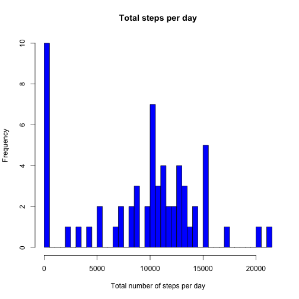

## Loading and preprocessing the data

```r
library("dplyr")
library("ggplot2")

# unzip and load the data into a data frame table
unzip(zipfile="activity.zip")
data <- tbl_df(read.csv("activity.csv"))
```

## What is mean total number of steps taken per day?
**Calculate the total number of steps taken per day**

```r
# calculate total steps made by day
totalStepsByDay <- 
    data %>%
    group_by(date) %>%
    summarise(totalSteps=sum(steps, na.rm = TRUE))
```

**Histogram of the total number of steps taken each day**

```r
# draw the histogram
hist(totalStepsByDay$totalSteps, main = "Total steps per day", col = "blue", 
     xlab = "Total number of steps per day", breaks=length(totalStepsByDay$date))
```

 

**Calculate the mean and median of the total number of steps taken per day**

```r
totalStepsByDayMean <- mean(totalStepsByDay$totalSteps)
totalStepsByDayMedian <- median(totalStepsByDay$totalSteps)
```
* Mean: 9354.2295
* Median:  10395

## What is the average daily activity pattern?
**Time series plot of the 5-minute interval and the average number of steps taken, averaged across all days**

```r
averageStepsByInterval <- 
    data %>%
    group_by(interval) %>%
    summarise(steps=mean(steps, na.rm = TRUE))
plot(averageStepsByInterval$interval, averageStepsByInterval$steps, 
     xlab='interval', ylab='Average number of steps taken', type='l')
```

 

**Which 5-minute interval, on average across all the days in the dataset, contains the maximum number of steps?**

```r
averageStepsByInterval[which.max(averageStepsByInterval$steps),]
```

```
## Source: local data frame [1 x 2]
## 
##   interval    steps
## 1      835 206.1698
```

## Imputing missing values

**Calculate the total number of missing values in the dataset**

```r
misisingValuesCount <- length(which(is.na(data$steps)))
```

Total number of missing values in the dataset: 2304

**Devise a strategy for filling in all of the missing values in the dataset**

Using the folowing r function I will create a new data set where all the
NA values for the steps variabl are replaced with their mean fot the invertal. 

```r
replaceNaWithMean <- function(steps, interval) {
    if (!is.na(steps))
        steps
    else
        averageStepsByInterval$steps[averageStepsByInterval$interval==interval]
}
```

**Create a new dataset that is equal to the original dataset but with the missing data filled in**


```r
filledNaData <- data
filledNaData$steps <- 
    mapply(replaceNaWithMean, filledNaData$steps, filledNaData$interval)
```

**Histogram of the total number of steps taken each day and Calculate and report the mean and median total number of steps taken per day**


```r
# calculate to total steps by day
filledNaData.totalStepsByDay <- 
    filledNaData %>%
    group_by(date) %>%
    summarise(totalSteps=sum(steps, na.rm = TRUE))

# create histogram
hist(filledNaData.totalStepsByDay$totalSteps, main = "Total steps per day - Imputed", 
     col = "blue", xlab = "Total number of steps per day", 
     breaks=length(filledNaData.totalStepsByDay$date))
```

 

```r
# calculate mean and median
filledNaData.totalStepsByDayMean <- mean(filledNaData.totalStepsByDay$totalSteps)
filledNaData.totalStepsByDayMedian <- median(filledNaData.totalStepsByDay$totalSteps)
```
* Mean: 10766.1887
* Median:  10766.1887

As one can see, the mean and the median increased. That make sense since before
imputing the missing values, we treated the NA values as 0, therefore they didn't
contribute to the total steps made in that day. After replacing the NA with the 
mean value, the total steps in a day increased, and therefore the mean and the
median increased.

## Are there differences in activity patterns between weekdays and weekends?

**Create a new factor variable in the dataset with two levels – “weekday” and “weekend” indicating whether a given date is a weekday or weekend day**

```r
# add another factor variable to indicate if the date is a weekday or a weekend
weekdays.weekends <- filledNaData %>%
    mutate(dayType = ifelse(as.POSIXlt(date)$wday %in% c(0,6), "WEEKEND", "WEEKDAY"))
```

**Make a panel plot containing a time series plot of the 5-minute interval and the average number of steps taken, averaged across all weekday days or weekend days**

```r
# calculate mean per interval per dayType
weekday.weekends.averages <- aggregate(steps ~ interval + dayType, data=weekdays.weekends, mean)
ggplot(weekday.weekends.averages, aes(interval, steps)) + geom_line() + 
    facet_grid(dayType ~ .) + xlab("interval") + ylab("Average number of steps taken")
```

 
